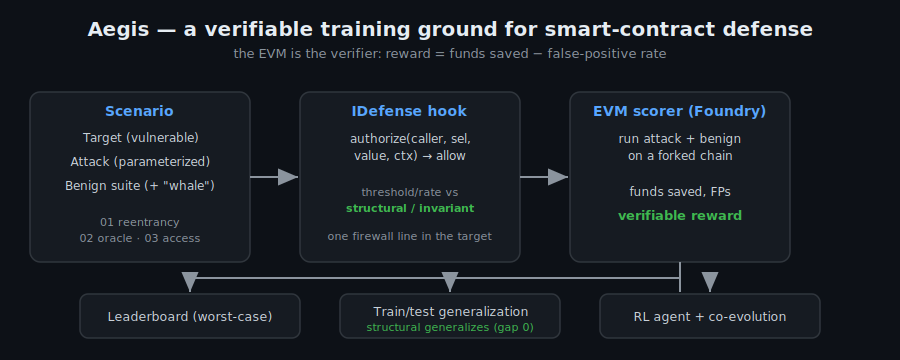
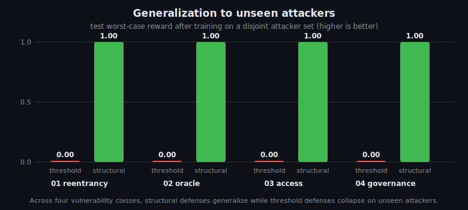

# Aegis

**A training ground for swarms of self-evolving smart-contract defense agents.**

[](https://github.com/baesy2/aegis/actions/workflows/ci.yml)
[](./LICENSE)
[](https://soliditylang.org/)
[](https://getfoundry.sh/)

> A single giant shield — an "Iron Dome" for DeFi — is expensive, centralized, and
> already being built by well-funded teams (Chainalysis Hexagate, Hypernative,
> SphereX). Aegis takes the other path: instead of one costly shield, train many
> cheap defense agents — "drones" — that learn by fighting attackers in a
> **verifiable simulation**, and prove themselves before they ever fly over real funds.

Aegis is the **SWE-bench of on-chain security**: an open, runnable environment
where a smart-contract defense is *trained* and *objectively ranked* by an
outcome the EVM itself certifies — funds saved, with no human labels.

<p align="center">
   IDefense hook -> EVM scorer -> leaderboard, generalization, RL" width="100%">
</p>

---

## TL;DR — the result that matters

> **Read this first:** the headline generalization result is a *constructed
> demonstration* on clean models, not field evidence; most fork tests use a
> synthetic manipulating swap (one real exploit — Inverse Finance — is replayed
> on archive state, but it fires the guard's *signal*, not a full attacker-
> calldata replay); and the "swarm" is a direction, not a shipped implementation.
> The honest threat model is in [`docs/LIMITATIONS.md`](./docs/LIMITATIONS.md) —
> the methodology is the contribution, not a guarantee. For the results that
> **are** measured on real mainnet data (a real exploit caught, false-positive
> rates on real traffic), see [`docs/WILD.md`](./docs/WILD.md).

The sharpest question a defense benchmark can answer is **generalization**: a
defense tuned against the attacks you've *seen* — does it hold against the ones
you *haven't*? Aegis makes that measurable, and the answer is consistent across
**four structurally different vulnerability classes**:

| Scenario | Defense family | Train | **Test (unseen)** | Gap |
|----------|----------------|:-----:|:-----------------:|:---:|
| 01 Reentrancy | rate / threshold | 1.00 | **0.00** | **1.00** ❌ overfits |
| 01 Reentrancy | **structural** (per-addr invariant) | 1.00 | **1.00** | **0.00** ✅ generalizes |
| 02 Oracle manip. | fixed price anchor | 1.00 | **0.00** | **1.00** ❌ overfits |
| 02 Oracle manip. | **structural** (lagged oracle) | 1.00 | **1.00** | **0.00** ✅ generalizes |
| 03 Access control | rate / threshold | 1.00 | **0.00** | **1.00** ❌ overfits |
| 03 Access control | **structural** (auth invariant) | 1.00 | **1.00** | **0.00** ✅ generalizes |
| 04 Gov. takeover | vote-count cap | 1.00 | **0.00** | **1.00** ❌ overfits |
| 04 Gov. takeover | **structural** (snapshot invariant) | 1.00 | **1.00** | **0.00** ✅ generalizes |

> Threshold/rate defenses score perfectly on the attackers they were tuned on and
> **collapse to zero** on held-out ones. Structural defenses — which enforce an
> *invariant* rather than fit a numeric boundary — **transfer perfectly**. The
> environment cleanly separates defenses that overfit from defenses that hold.

<p align="center">
  
</p>

Reproduce it in one command: `cd aegis-gym && python3 -m aegis generalize`. The
chart above is regenerated by `aegis bench` directly from the EVM scores.

## At a glance

Everything below runs from one dependency-free CLI; every number is EVM-verified.

| Capability | What it shows | Command |
|------------|---------------|---------|
| **5 vulnerability classes** | reentrancy, oracle, access, governance + a no-free-lunch behavioral class | `forge test` |
| **Generalization** | structural defenses transfer to unseen attackers (gap 0); thresholds overfit (gap 1) | `aegis generalize` |
| **Leaderboard + chart** | worst-case ranking per class, auto-generated | `aegis bench` |
| **Co-evolution** | attacker/defender arms race (0.00 → 0.50 robustness) | `aegis coevolve` |
| **AMM arms race** | attacker *search* discovers split-trade evasion (98% drain); defender best-responds with a windowed cap (→ 4.7%) | `aegis dex-coevolve` |
| **Swarm training** | a population of attacker/defender agents co-evolves; the swarm-trained defense caps unseen attackers at **4.7%** vs **33%** for single-threat tuning | `aegis arena` |
| **Policy-gradient RL** | an agent learns a robust defense from the reward alone | `aegis train` |
| **~10^10 space** | parameter ranges × 2^N defense compositions | `aegis space` |
| **Dataset + model** | 2,300+ EVM-verified labels; a "will this hold?" classifier | `aegis dataset` / `classify` |
| **Recommender** | "for this threat, deploy this defense" | `aegis recommend` |
| **Cross-class transfer** | defense-quality is class-specific (+17% gap) — breadth matters | `aegis transfer` |
| **Robust / minimax** | optimal defense under unknown attacker; regret of not knowing | `aegis robust` |
| **Pareto frontier** | structural classes collapse to one defense; behavioral is a real trade-off | `aegis pareto` |
| **Forked-mainnet** | DEX guards on live Uniswap V2 + Sushiswap + real Chainlink — 3-source consensus, TWAP, and price-impact, each with a real executed swap | `make fork` |
| **Real exploit replay** | two independent guard signals fire on the **actual** Inverse Finance oracle manipulation (Apr 2022): a 56x pump diverges from the genuine TWAP, and the 300-WETH swap is a 98% price impact — both blocked ([corpus](./docs/EXPLOITS.md)) | `make exploit` |
| **Wild test** | all three oracle guards on real mainnet data: price-impact (6,847 swaps, 0.03% FP at 2%), TWAP (2,989 samples, 0.00% FP at 2%), and consensus — a shallow reference false-positives **14%** at 0.5% but a **deep** V3 reference cuts it to **0.31%** (26,663 samples). Wild data finds each guard's safe threshold *and* the consensus fix | `aegis wild` |

## For protocols: defenses validated on live mainnet state

Every oracle/liquidity guard below is tested on a **forked mainnet** — real
reserves, a real executed swap that manipulates the price, and the live Chainlink
feed — so you see it hold (or block) under your actual deployment's conditions,
not a toy mock. They span two families and a runnable drop-in. Run them all with
`make fork` (point `MAINNET_RPC_URL` at any full node).

| Guard | Threat | What the fork test proves |
|-------|--------|---------------------------|
| `MultiSourceConsensusGuard` | one venue manipulated | 3 independent venues (Uniswap V2 + Sushiswap + Chainlink) agree ≈$1,723 → allowed; a real swap crashes Uniswap to ≈$768 → the outlier is blocked |
| `UniswapV2TwapGuard` | flash / single-block manipulation | builds a real 30-min TWAP (≈$1,725) from on-chain accumulators; spot crashed to ≈$768 in one block, TWAP unmoved → blocked |
| `PriceImpactGuard` | flash drain / sandwich setup | on live reserves, a 0.1%-of-pool swap = 20 bps (allowed); a half-pool drain = 5552 bps (blocked) |
| `examples/ProtectedSwapPool` | — | the **one-line hook** wired into a swap path: a draining trade reverts `AEGIS_BLOCKED` at the door; the same pool with no defense lets it through |

**How strong is each guard?** `test/GuardCalibration.t.sol` quantifies it
deterministically: a 2% price-impact cap permits a single trade of at most ~1% of
the pool, and to push a TWAP past a 5% cap an attacker who crashes spot 50% must
*sustain* it for ~180s of a 30-minute window — long enough for arbitrage to drain
them. The guarantees are checked-in asserts, not claims.

The adoption guide is [`docs/INTEGRATION.md`](./docs/INTEGRATION.md): the one line,
the `ctx` contract per threat, and how to pick, write, or train a defense.

## Why this exists

1. **Defense is now a learning problem, and learning needs an environment.**
   Reinforcement learning with *verifiable rewards* (math, code) is the most
   sought-after training signal in AI today. Smart-contract defense is natively
   verifiable: an exploit either drains funds on a forked chain, or it does not.
   That binary, execution-grounded outcome is a clean, ungameable reward.

2. **No open standard exists.** Monitoring vendors are closed SaaS. Academic
   work (EVMbench, SmartCoder-R1) is fragmented and offense-leaning. There is no
   shared, runnable, defense-oriented environment. Aegis aims to be it.

3. **The asset compounds.** Every defense submitted and every scenario added
   accumulates a corpus of attack/defense trajectories — the durable, hard-to-
   replicate moat, owned by the range rather than any single defender. This is
   concrete, not aspirational: the repo ships an **EVM-verified labeled dataset**
   of 1,000+ defense matchups ([`data/trajectories.jsonl`](./data/trajectories.jsonl),
   see [`data/DATASET.md`](./data/DATASET.md)), and you can extend it indefinitely
   with `python3 -m aegis dataset --budget N`. Each record is `(scenario, defense
   params, attacker) → (funds saved, false positives, reward)` — a ready-made
   training set. `python3 -m aegis classify` closes the loop: it trains a
   model on that corpus to predict **whether a defense will hold, without running
   the EVM** (≈85% test accuracy today), and it sharpens as the dataset grows.

## Quickstart

```bash
# 1. install Foundry (the EVM scorer) and the test library
curl -L https://foundry.paradigm.xyz | bash && foundryup
forge install foundry-rs/forge-std

# 2. run the scenarios + static scoreboards (all green)
forge test

# 3. drive the whole benchmark from one CLI
cd aegis-gym
python3 -m aegis list                 # registered vulnerability classes
python3 -m aegis bench                 # full leaderboard + generalization -> LEADERBOARD.md
python3 -m aegis generalize            # the headline train/test study
python3 -m aegis coevolve reentrancy   # an attacker/defender arms race
python3 -m aegis train reentrancy      # a policy-gradient agent learns a defense
python3 -m aegis dataset --budget 200  # grow the EVM-verified trajectory dataset
python3 -m aegis classify              # train a "will this defense hold?" model
python3 -m aegis recommend governance  # recommend the defense to deploy for a threat
python3 -m aegis space                 # the ~10^10 combinatorial space size
python3 -m aegis transfer              # does defense-quality generalize across bug classes?
python3 -m aegis robust                # minimax defense under attacker-type uncertainty
python3 -m aegis explore --scenario behavioral   # active learning vs random (honest)
python3 -m aegis score access owneronly 11   # score one matchup on the EVM
```

No Python dependencies are required — the core only needs `forge` on your PATH.
Everything is also exposed as `make` targets (`make bench`, `make generalize`,
`make rl-train`, …).

## The benchmark today

Four vulnerability classes, each with a vulnerable target, a parameterized
exploit, a legitimate-traffic suite (including an adversarial-looking-but-honest
"whale"), and competing defense families:

| # | Class | The bug | Threshold defense (overfits) | Structural defense (generalizes) |
|---|-------|---------|------------------------------|----------------------------------|
| 01 | **Reentrancy** | interaction-before-effects drain | windowed outflow rate limit | per-address, per-tx balance invariant (EIP-1153) |
| 02 | **Oracle / price manipulation** | collateral valued at AMM spot price | fixed price-deviation anchor | one-block-lagged oracle (mini-TWAP) |
| 03 | **Broken access control** | privileged function missing its auth check | value/rate cap on withdrawals | identity invariant ("only the admin may call") |
| 04 | **Flash-loan governance takeover** | votes counted at current balance | vote-count cap | snapshot invariant (prior-block holdings) |

Each class models a category responsible for real, nine-figure losses:

| Class | Representative incidents (illustrative) |
|-------|------------------------------------------|
| Reentrancy | The DAO (~$60M, 2016); Cream Finance (~$130M, 2021) |
| Oracle / price manipulation | Mango Markets (~$114M, 2022); Harvest Finance (~$24M, 2020) |
| Broken access control | Parity multisig freeze (~$150M+, 2017); a recurring top loss category in bridge hacks |
| Flash-loan governance | Beanstalk (~$182M, 2022) |

### Scenario 05 — when structure *fails* (the no-free-lunch frontier)

The four classes above all have a clean structural answer. Scenario 05
(`test/Behavioral.t.sol`) is the deliberate counter-example, so the benchmark
isn't just five reruns of "structure wins": a **stolen-key account drain**, where
the thief holds the owner's key and so passes the authorization invariant that
wins Scenario 03. Structure is useless; the only signal is behavioral, and
legitimate vs. malicious behavior genuinely overlap. Scored as a precision/recall
frontier (recall = attacks blocked, FP = legitimate withdrawals blocked):

| Defense | False positives | Attacks caught | Reward (TPR−FPR) |
|---------|:---------------:|:--------------:|:----------------:|
| owner-only (authorization invariant) | 0/8 | **0/6** | 0.00 |
| amount cap | 1/8 | 4/6 | 0.54 |
| new-destination only | 2/8 | **6/6** | 0.75 |
| **behavioral (feature-combining)** | **0/8** | 5/6 | **0.83** |

**No defense reaches perfect recall at zero false positives** — catching the
patient thief who mimics a small payment to a new payee necessarily costs a false
positive. The feature-combining (learned-shape) defense is the best operating
point but cannot erase the overlap. This is where a *learned* defense becomes
necessary, not optional — and where the verifiable reward measures a real
security frontier rather than a clean win.

The full, **auto-generated** ranking lives in [LEADERBOARD.md](./LEADERBOARD.md)
(regenerate with `aegis bench`). Each defense is ranked by **worst-case reward**
— the minimum, over the entire attacker grid, of `funds_saved − false_positive_rate`
— because a production defense is only as good as its worst day against any
attacker in the family. The structural defense tops every scenario. The task is
pinned as a frozen, versioned spec in [BENCHMARK.md](./BENCHMARK.md) so scores
stay comparable over time (the SWE-bench model).

## "Four scenarios" is the seed of a ~10^10 space

A handful of hand-written scenarios undersells what is being measured. Once you
count parameter ranges, attacker strengths, and — above all — **defense
compositions** (`CompositeDefense` stacks any subset of compatible primitives, so
N primitives give 2^N defense-in-depth stacks), the number of distinct,
EVM-scorable matchups is enormous. `python3 -m aegis space` computes it from
explicit, auditable cardinalities:

```
scenario        singletons   composites  attackers        matchups
reentrancy           4,098       28,676         64       1,835,264
oracle               4,000    8,004,000      1,000   8,004,000,000
access               4,097       12,289         64         786,496
governance          10,001       30,001    100,000   3,000,100,000
behavioral             129       16,769        100       1,676,900
TOTAL                                               ~1.1 x 10^10
```

The shipped dataset samples ~10^-7 of the space. The value is not the targets —
it is the **~10^10-point space they generate and the engine that scores any point
of it on the EVM.** Composition is real and non-trivial: stacking a perfect
structural defense with a rate limit *lowers* reward (1.00 → 0.75) because the
stack inherits the limiter's false positives.

And the classes are not redundant: a "will this defense hold?" model trained on
every class *except* one transfers poorly to the held-out class (mean
within−cross accuracy gap **+17%**, up to +36% for governance — run
`aegis transfer`). Each vulnerability class carries information the others don't —
the quantitative case for breadth.

> **Integrating a protocol?** See [docs/INTEGRATION.md](./docs/INTEGRATION.md) —
> the one-line hook, the `ctx` contract per threat, picking/writing/training a
> defense, and validating it against your live mainnet state.

## The core abstraction

A **Scenario** = a vulnerable `Target`, a verified exploit `Attack`, and a
`Benign` traffic suite.

A **Defense** implements exactly one method — a single-line firewall hook a
protocol drops in at the top of a sensitive function:

```solidity
interface IDefense {
    function authorize(address caller, bytes4 selector, uint256 value, bytes calldata ctx)
        external returns (bool allow);
}
```

The **Reward** is execution-derived and deliberately not gameable:

```
reward = W_BLOCK · fundsSaved  −  W_FP · falsePositiveRate        (range −1 … +1)
```

Blocking everything earns the protection term but pays the full false-positive
penalty — netting zero, the same as doing nothing. Positive scores require
**precision**: stop the exploit while keeping legitimate users alive. That is
the real production constraint (a paused protocol is itself an outage), made
measurable.

## Defense is a learning problem — watch an agent learn one

`aegis train` runs a **policy-gradient agent** (a diagonal-Gaussian REINFORCE,
pure Python — no numpy/torch) over a *continuous* circuit-breaker configuration.
Each step is scored on the EVM against the **entire** attacker grid and the agent
optimizes the **worst-case** reward, so it is pushed toward a *robust* defense,
not one tuned to a single attacker:

```
 ep  window   cap   reward  sigma   best
  1      10    11     0.00   2.91   (10, 11)
  6       8     4     0.30   2.48   (8, 4)
 ...
 -> learned robust policy: window=9 cap=1 -> worst-case reward 0.75
```

From the verifiable reward alone, continuous search **beats the hand-picked grid**
(whose best worst-case reward is 0.25) — yet it never reaches 1.0, because any
rate cap that stops the patient drain also blocks the legitimate whale. Switch to
the structural family and the agent trivially scores 1.0. **The environment
teaches the same lesson the benchmark proves: structure beats thresholds.**

(The original epsilon-greedy bandit demo — an agent discovering the optimal cap
from scratch — is still here: `python3 aegis-gym/train.py`.) The environment and
agent are documented in [docs/RL.md](./docs/RL.md).

## Add your own defense in ~5 minutes

1. Implement `IDefense` in `src/defenses/YourDefense.sol`.
2. Point a target's hook at it (or reuse a scenario's env-driven matchup).
3. Score it on the EVM:
   ```bash
   cd aegis-gym && python3 -m aegis score reentrancy yourdefense 2
   ```

Even simpler — **submit without touching the registry, for any of the five
classes**: drop your defense into `submissions/<scenario>/Submission.sol`
(reentrancy uses `submissions/Submission.sol`) and run
`python3 -m aegis submit <scenario>`. The harness scores it across that
scenario's attacker grid and tells you your worst-case reward and where you'd
rank. This is the local form of the hosted "submit a defense, get scored, climb
the board" loop — and, run across many contributors, the mechanism that
accumulates the multi-party dataset moat.

Adding a whole new **vulnerability class** is one `Scenario(...)` entry in
`aegis-gym/aegis/registry.py` plus its Solidity target/exploit/defenses — and it
then flows into the leaderboard, the generalization study, and the arms race
automatically. See [docs/SCENARIOS.md](./docs/SCENARIOS.md).

## Layout

```
src/
  interfaces/IDefense.sol             # the one interface every defense implements
  lib/Reward.sol                      # the verifiable reward function
  scenarios/reentrancy|oracle|access  # targets + canonical exploits
  defenses/                           # reference defenses (rate, behavioral, oracle, identity)
test/
  base/*Scenario.sol                  # measurement cores
  *.t.sol                             # static scoreboards (assert the frontier)
  Matchup*.t.sol                      # env-driven scorers the gym calls
aegis-gym/
  aegis/                              # the benchmark package: registry, analysis, env, agents, CLI
  tests/                              # forge-free unit tests
  train.py, coevolve.py, ...          # standalone paper-reproduction scripts
scoring/                              # machine-readable outputs (leaderboard.json, ...)
docs/                                 # PAPER, DESIGN, ROADMAP, SCENARIOS
LEADERBOARD.md                        # auto-generated ranking
```

## Project status

Past proof-of-concept: a verifiable environment with **four vulnerability
classes**, a unified benchmark/leaderboard, a continuous policy-gradient learner,
and reproducible results — co-evolution beats single-attacker training (worst-case
funds saved 0.00 → 0.50), structural defenses cross the floor threshold defenses
hit (perfect reward, zero false positives), and under a train/test split those
structural defenses **generalize to unseen attackers (gap 0.00)** while
threshold/rate defenses **overfit (gap 1.00)** — in every class. Not yet a
large-scale hosted platform; see [docs/ROADMAP.md](./docs/ROADMAP.md). Paper
draft: [docs/PAPER.md](./docs/PAPER.md). Design: [docs/DESIGN.md](./docs/DESIGN.md).

## Roadmap

- **Scenarios:** `01 reentrancy`, `02 oracle manipulation`, `03 access control`,
  `04 flash-loan governance takeover` (done) → `05 ERC4626 share-inflation` →
  `06 honeypot/canary tripwire`.
- **Forked-mainnet (started):** the oracle guards run against **live Uniswap V2
  state** (`make fork`) — `ForkOracle` reads real reserves and computes a
  real constant-product manipulation, and `ForkSwap` goes further and **executes
  a real swap** on the live pool (wrapping ETH→WETH and moving the on-chain price,
  e.g. $1,726 → $768 in one tx) and shows the lagged guard blocks it. Both skip
  without an RPC so default CI stays green — the bridge from synthetic to
  non-reproducible data.
- **Learning (done):** a Gymnasium-style env + a continuous policy-gradient agent
  that learns a robust defense from verifiable reward alone.
- **Co-evolution (done):** adaptive attacker/defender arms race over the reward.
- **Leaderboard automation (done, GitHub-native):** every PR is scored on the
  EVM and the ranking is posted back as a comment (`.github/workflows/leaderboard.yml`)
  — submit a defense, get scored, climb the board. A hosted service that
  accumulates submitted trajectories as a public dataset is next.

## Scope and safety

Aegis is **defensive**. Targets and exploits are curated, well-known vulnerability
classes used to *train and measure defenses*. It is not a tool for discovering or
launching attacks against live systems, performs no attribution or "hack-back,"
and confines any adaptive attacker to simulation. Contributions must stay within
that scope — see [CONTRIBUTING.md](./CONTRIBUTING.md).

## License

MIT. See [LICENSE](./LICENSE).
